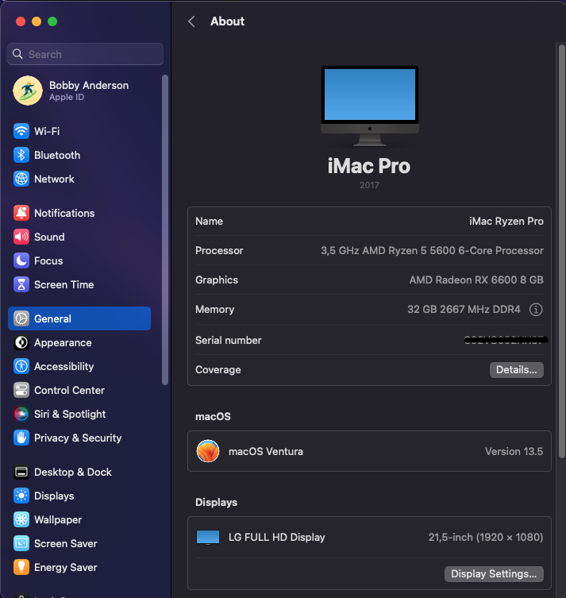
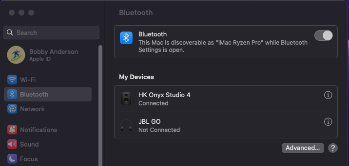
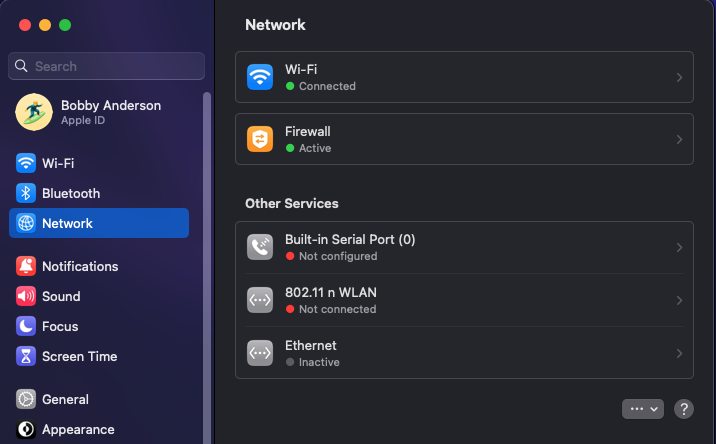
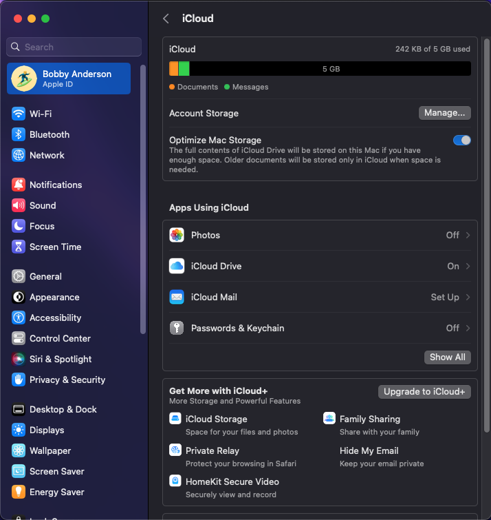
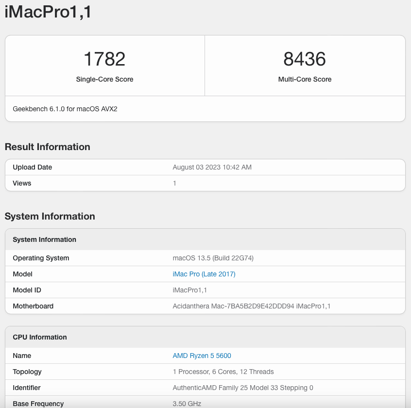
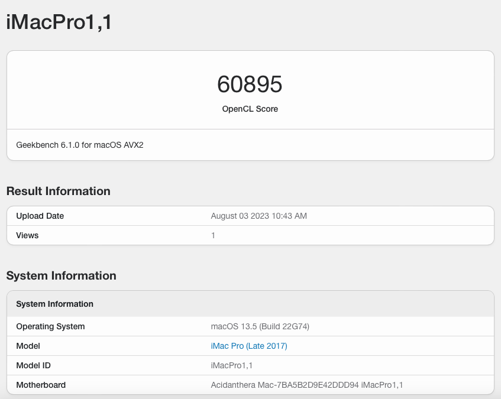

## OpenCore
| Bootloader  | macOS             |
|-------------|-------------------|
| OpenCore 0.9.3 | Ventura 13.5 |

## Specification
| Name           | Detail                        |
|----------------|-------------------------------|
| Motherboard    | ASRock B550M Pro4             |
| Processor      | AMD Ryzen 5 5600              |
| VGA Card       | ASRock AMD Radeon RX 6600     |
| Memory RAM     | 32 GB ( 4x8GB 2666 MHz DDR4 ) |
| Storage        | MSI Spatium M390 250GB        |
| WiFi/Bluetooth | Intel AX200 NGFF M.2          |

## Credit and Links
https://github.com/maxswjeon/OpenCore-5600X-B550-RX560

## PoC

